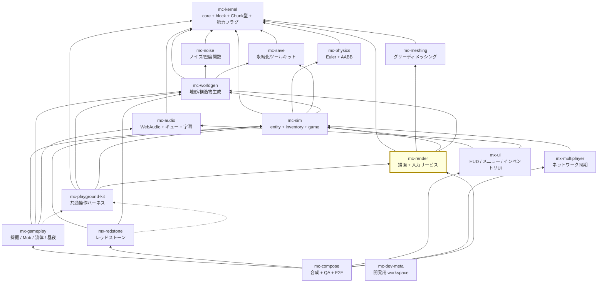

# アーキテクチャ

## 1. 4階層

plan.md §2.2 の 4 階層。**リポジトリ = 検証・リリースの単位**であり、パッケージ（依存境界）や
プレビュー（起動）とは別の単位である（plan.md §2.4。混同しないこと）。

| 階層 | リポジトリ | 性質 |
| --- | --- | --- |
| 安定ライブラリ | kernel / noise / meshing / physics / save / audio | 純粋関数・狭い界面・変更頻度が低い。相互独立で並行構築可能 |
| **基盤** | worldgen / sim / **render** / kit | 状態とサービス（**名詞**）。体験モジュールが乗る土台 |
| 体験モジュール | gameplay / redstone / ui / multiplayer | ルールとUI（**動詞**）。互いを知らず、基盤サービス経由でのみ会話 |
| 合成 | compose | Layerマージ + stage順序表 + E2E。ロジックを持たない |

mc-render は**基盤**。plan.md §7 の機能カバレッジ表で「描画・ポストFX・パーティクル・投射物トレーサー」と
「実行時入力（キーボード/マウス/ポインタロック/タッチ/リマッピング）」の**両方**を割り当てられている唯一のリポジトリである。

## 2. 依存グラフ全体（16リポジトリ）

実線 = 実行時依存（`dependencies`）、点線 = プレビュー起動時のみ（`devDependencies`）。
`mc-kernel` はどこからでも import 可能なため、矢印は引くが許可リストには書かない。



### 15 と 16 の数え方

plan.md の見出しと §2.4 は「**15 リポジトリで固定**」と書き、§6 Step 0 が別途
`mc-dev-meta` workspace の作成を指示している。つまり:

- **ゲームを構成するリポジトリ = 15**（kernel / noise / meshing / physics / save / audio /
  worldgen / sim / render / kit / gameplay / redstone / ui / multiplayer / compose）
- **依存ホワイトリストが知るべきリポジトリ = 16**（上記 + `mc-dev-meta`）

この図は組織側の依存計画を記録するものであり、`mc-render` がローカルに
`REPOSITORY_POLICY` や依存ホワイトリストを複製することを意味しない。各 package の
直接依存宣言と TypeScript の import graph が実装上の境界である。

`mc-dev-meta` は 15 リポジトリの clone を `repos/` に並べて 1 つの pnpm workspace として
束ねる薄いリポジトリで、開発中は `workspace:*` 解決でモノレポ同等の DX を得る。
npm 公開・バージョン bump は各 package の公開手順で管理し、この package の公開面は
`src/index.ts` と到達可能な型を source of truth とする。

この境界は各 package の直接依存宣言と TypeScript の import graph に記録される。`pnpm typecheck`
と lint は、現在のソースが公開された型・構文・依存宣言に対して成立することを検証する。

### 2.1 TypeScript の実行系と compiler API

通常の型検査・ビルドは TypeScript 7 を使う。一方、テストが `ts.createProgram` や
`ts.readConfigFile` を直接呼ぶ箇所には `typescript-compiler-api`（TypeScript 6 の npm alias）を
使う。TypeScript 7 の公開 runtime package は version metadata のみを公開し、これらの compiler API
を持たないためである。したがって、これは旧 API を出荷物へ持ち込む互換アダプタではなく、
テスト専用の compiler API 境界である。

## 3. mc-render の位置

### 3.1 親（mc-render が import してよいもの）

| 依存先 | 何をもらうか |
| --- | --- |
| `mc-kernel` | 共有語彙。**どのリポジトリからも import 可**。ただし `package.json` の `dependencies` への記載は必要 |
| `mc-meshing` | `mesh(chunk, neighbors, config) → {opaque, water, transparentSolid, crossPlants, fluids}` と公開 quad 型 |
| `mc-sim` | `CameraPoseSnapshot`、描画すべき状態（チャンクダーティ購読は mc-worldgen） |
| `mc-worldgen` | `Chunk` データ、ライトグリッド（BFS光伝播の結果。**適用**がこちらの責務） |

### 3.2 子（mc-render に依存するもの）

`mc-playground-kit` と **`mc-compose`** は mc-render を利用するホスト側である。
kit は共通プレビューの入力・品質設定・起動を組み立て、compose は複数 package を統合する。
どちらも mc-render の実行時依存ではないが、mc-render の公開 API を利用するため、
`src/index.ts` と stage 登録の界面は安定させる必要がある。

### 3.3 推移閉包は禁止

`mc-render → mc-sim → mc-physics` だが、**mc-render は mc-physics を import できない**。
レンダラはシミュレーションが「真である」と言ったものを描くのであって、
衝突判定をやり直さない。やり直せば「描かれている世界」と「シミュレートされている世界」が
同じ問いへの独立した 2 つの答えになり、必ず食い違う。

同様に `mc-save` も推移依存であり import 禁止。レンダラはセーブファイルを読まない。
直接依存宣言と import graph を越えた利用は、公開ソースの型検査とレビューで防ぐ。

## 4. 構成の成立条件（plan.md §2.3）

### 4.1 §2.3-1 基盤 = 名詞、体験 = 動詞

mc-render は**名詞**の側。「どう見えるか」の仕組みを持ち、「何が起きるか」のルールは持たない。

| 置く（名詞） | 置かない（動詞。mx-gameplay 等へ） |
| --- | --- |
| `InputService`（キーが押されているという**状態**） | 「W を押したら歩く」 |
| `WorldRenderer`（チャンクをメッシュにして描く） | 「掘ったらブロックが消える」 |
| ポストFXチェーン（品質設定に応じたパスの並び） | 「夜になったら暗くなる」 |
| パーティクルの描画機構 | 「爆発したらパーティクルを出す」 |

**入力の扱いに注意。** `InputService` が答えるのは「`moveForward` に割り当てられたキーが今押されているか」
までであり、「だから前に進む」は mc-sim（状態遷移）と mx-gameplay（ルール）の仕事である。
plan.md §4.2 の stage 順序 `input → simulation → ...` は、この境界が実行順序として現れたものである。

### 4.2 §2.3-2 mc-playground-kit は devDependency 専用 — **本リポジトリの存在理由**

plan.md §2.3-2 の原文:

> **実行時入力サービスは mc-render が所有。** kit は devDependency 専用のため、
> kit に入力を置くと本番ゲームから入力が消える。kit の役割は
> 「ミニ世界 + カメラ + レンダラ + 入力を1秒で束ねる糊」に限定

kit は出荷ビルドに入らない。もし実行時入力サービスが kit にあったら、リリースビルドは
**ビルドが通り、起動し、描画し、キーボードを完全に無視する**。コンパイル時に無音で、
実行時に全損。これが最悪の組み合わせであり、だから機械的に防いでいる。

| 境界 | 現在の確認方法 |
| --- | --- |
| `dependencies` の runtime 宣言 | `package.json` と `pnpm typecheck` |
| shipped source からの import | TypeScript の import graph と公開面のレビュー |

kit は実行時エッジを作らないため、renderer の runtime dependency には含めない。

**逆向きの誤解に注意**: 制約は「誰が kit に依存してよいか」についてのものである。
kit 自身が mc-render に依存するのは正常な実行時依存であり、何も問題はない。

### 4.3 §2.3-3 stage 実行順序表は compose が唯一所有

各モジュールは `StageRegistration` で**順序制約（`after`）を宣言するだけ**であり、
全順序は mc-compose が解決する（plan.md §4.1 / §4.2）。

標準 stage 順序（plan.md §4.2）:

```
input → simulation(physics → interactions → entities → fluids → redstone → time/weather)
      → camera-mirror → chunk-sync → render → post-fx → hud-sync
```

**この 8 段のうち 5 段が mc-render の担当**（`input` / `camera-mirror` / `chunk-sync` /
`render` / `post-fx`）だが、**mc-render はこの表を持たない**。`after` 制約を宣言するだけである。

読み取れることが 2 つある。

1. **`camera-mirror` は `simulation` の後**。姿勢は sim が確定させてから render がミラーする。
   逆順にすると 1 フレーム古い姿勢を描くことになり、参照実装の逆転構造が実行順序の形で復活する。
2. **`post-fx` は `render` の直前にチェーンを選択する独立段**。`domain/post-processing.ts` の
   チェーン順序はこの段の**内部**の話で、選択済みの計画を `DrawPort` へ渡す。実際の
   `EffectComposer` pass 生成・実行は `src/browser.ts` の既定ブラウザ境界、または外部ホストの adapter の責務であり、stage 順序表とは別物である。

### 4.4 §2.3-4 プレビューは検証対象と同居

mc-render の内蔵プレビューは **fixture ビューア**（固定チャンクを読み込んでマテリアル / ポストFX を
目視確認）であり、`apps/preview-*/` に置く。UI だけの独立リポジトリは作らない。

## 5. カメラ所有権 — mc-render は正ではない

plan.md §5.1-2「カメラ姿勢は sim 所有」。詳細と参照実装の証跡は
[design-notes.md](./design-notes.md) の DN-06。ここでは構造だけ。

```
【参照実装（誤り）】                     【新設計】
  sim ──yaw/pitch──▶ THREE.Camera        sim ──CameraPoseSnapshot──▶ render
   ▲                      │                                            │
   └──position/direction──┘                                       THREEカメラへ
       （13箇所が読み戻す）                                  ミラーするだけ（書き戻し無し）
```

構造的保証は**依存の向き**である。`mc-render → mc-sim` があるため `mc-sim → mc-render` は循環になり、
package の直接依存宣言と import graph のレビューで逆向きの参照を許さない。mc-sim には
「レンダラに問い合わせる」という選択肢がそもそも存在しない。

攻撃スイングのバンプのような演出は、ミラーした姿勢の**上に**適用し、mc-sim には戻さない。
`domain/camera-mirror.ts` の `ViewOffset` がその置き場である。

## 6. なぜコア入口とブラウザ入口を分けるのか

**意図的**である。`domain/` は純粋な値と関数で構成し、コアの `./` 入口と
`application/three-surface.ts` は Three の実行時 namespace ではなく、必要な構造的な surface を
受け取る契約だけを定義する。DOM・Three・EffectComposer を実際に接続する公開ブラウザ入口は
`./browser`（`src/browser.ts`）として分離している。

| 本来 THREE.js に埋まっている知識 | ここでの表現 | 効果 |
| --- | --- | --- |
| `composer.addPass()` の呼び出し順 | `POST_PROCESSING_PASS_ORDER` 配列 + 検証関数 | 順序バグが GPU 無しの単体テストで落ちる |
| どのマテリアルに `forceSinglePass` が要るか | `requiresForceSinglePass` 述語 | マテリアルを名指しせず**規則**で表現できる |
| どのイベントをどこに登録するか | `LISTENER_PLAN` + `GAMEPLAY_LISTENER_TARGET` | window/document の遮蔽関係を DOM 無しで assert できる |
| フレーム毎の一時オブジェクト再利用 | `withScratch` | private native `Map` と lease facade により、返却後の直接利用・wrapper・iterator を実行時に検出できる |

これらは全部、参照実装では**文の並び順**にしか書かれておらず、読むことでしか検査できず、
GPU が無いとテストできなかった知識である。データにすると `environment: 'node'` で固定できる。

既定の `src/browser.ts` の THREE.js adapter は、これらのデータを読んで concrete pass を
`composer.addPass` へ渡す。外部ホストも同じ契約へ独自実装を注入でき、順序規則そのものは
GPU 不要のコアテストで固定される。

`tsconfig.base.json` の `lib` に **`"DOM"` は入っていない。`window` 入力アダプタが入った後もである。**
アダプタが実際に触る DOM メンバは 8 個しかないので、`application/dom-surface.ts` に
**構造的な型**として書いてある。1 つのアダプタのために全ファイルから
「`environment: 'node'` で検査できる」という歯止めを外すのは高すぎ、
しかも plan.md §3.10 によりブラウザ側にも逃げ場が無い（Playwright はポインタロック不可）。
実物の `Window` が**キャスト無しで**適合することはテストで証明してある
（[design-notes.md](./design-notes.md) DN-15、[testing.md](./testing.md) §8.1）。

`application/three-surface.ts` の基底面は `WebGLRenderer`、`Scene`、`PerspectiveCamera`、
`BufferGeometry`、`BufferAttribute`、`Mesh`、`MeshBasicMaterial` を扱い、shader と instancing
用の拡張面を分けている。`application/world-renderer.ts` は基底面を使って chunk mesh、scene、
camera、draw の契約を実装し、`application/world-renderer-production.ts` がその契約へ chunk
shader、水面 shader、instanced particle を組み合わせる。実際の Three namespace、canvas、WebGL/GPU は
既定の `src/browser.ts` または外部ホストが接続し、生成RGBA・URLアトラスの texture 転送は
ブラウザ入口が扱う。したがって Node preview でも描画同期と shader 入力の契約を検証できる。
